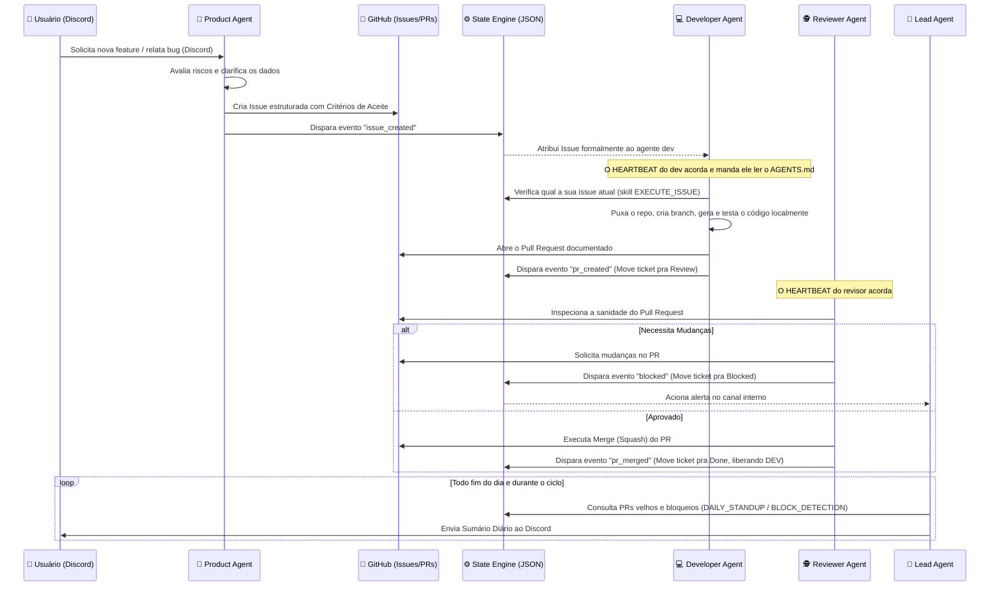

# OpenClaw Multi-Agent Ecosystem

O **OpenClaw Multi-Agent System** é uma arquitetura autônoma de desenvolvimento de software governada por Inteligência Artificial. Ele utiliza múltiplos agentes especializados que cooperam para gerenciar todo o ciclo de vida do desenvolvimento — desde a concepção do produto no Discord até o merge do código no GitHub —, mantendo uma rígida separação de responsabilidades (Triggers, Workflows e Skills) e um motor central de estados (`state-engine`).

## 🧠 Arquitetura de Agentes

O ecossistema é composto por quatro agentes com responsabilidades bem definidas, que assumem a forma de uma squad ágil de alta performance:

- 🎒 **Product Agent:** Interage com os stakeholders vi Discord, ajuda na ideação, analisa riscos corporativos e converte intenções em "GitHub Issues" ricas e estruturadas.
- 💻 **Developer Agent (Alfred):** Absorve as issues designadas a ele, opera no ambiente local (`workspace`), executa o código sob os critérios de aceite e propõe Pull Requests.
- 🕵️ **Reviewer Agent:** Monitora a fila de Pull Requests. Inspeciona o código, avalia a sanidade dos testes e a cobertura dos requisitos. Ele aprova (merge) ou barra (bloqueia) e solicita mudanças.
- 👔 **Lead Agent (Scrum Master):** Atua no cronograma diário montando reportes de Standup diários, avaliando gargalos crônicos (como PRs ou issues paradas) e alertando a equipe de anomalias no fluxo.

## 🔄 Fluxo de Trabalho (Workflow)

Abaixo o diagrama exato de como as entidades se comunicam assincronamente através do `state-engine` e do GitHub, formando o ciclo de vida de uma feature.



## ✨ Principais Funcionalidades

1. **Arquitetura Desacoplada e Segura:**
   - `HEARTBEAT.md`: Atua apenas como "Despertador" temporal. Nenhum comando sensível vive aqui.
   - `AGENTS.md`: Define a lógica processual e comportamental de cada cargo.
   - `SKILLS.md` & `scripts/*.sh`: Segura a "Força Bruta" e as integrações (Scripts, GH CLI, JQ), impedindo alucinações de comandos.
2. **Motor de Estado e Orquestração (`state_engine.sh`):**
   - Transita tarefas no `state.json`, garantindo que os agentes saibam exatamente qual é a pauta real.
   - **Sincronização Automática:** Gerencia labels de status (`inbox`, `in_progress`, etc) e de responsabilidade (`agent:product`, `agent:developer`, `agent:reviewer`) tanto na Issue quanto no PR associado.
3. **Automação de Board e Discord:**
   - **Workflow de Board Robusto:** Integração nativa com GitHub Projects. Issues são criadas diretamente no board via flag `--project` e sincronizadas via GraphQL via `automation.sh`.
   - **Interação Estabilizada:** Otimizações no provisionamento evitam reboots desnecessários, resolvendo o erro `Unknown Interaction` no Discord.
   - **Modo Escuta Ativa:** Agentes de produto operam em modo passivo nos canais, reagindo a demandas sem necessidade de menção `@nome`.
4. **Identidade e Rastreabilidade:**
   - Prevenções para que commits e features não vazem o tracking (ex: Developer assina commits como `alfred-ai-developer`).
   - Ciclo de feedback fechado: Desenvolvedores são alertados e reatribuídos automaticamente quando o review solicita mudanças (`blocked` status).
5. **Estrutura de Threads Elite (`squad` & `lead`):**
   - Transparência total sem ruído: A comunicação técnica ocorre na thread `#squad` (Developer/Reviewer) e a gestão técnica na thread `#lead` (Lead/Standups).
   - Automação via Skill: As threads são criadas automaticamente pela skill `START_PROJECT`, garantindo isolamento total desde o primeiro minuto do projeto.

## 🚀 Instalação e Configuração

### 1. Pré-requisitos

Certifique-se de que os seguintes itens estão instalados e autenticados:

| Ferramenta                       | Para quê                     | Verificar                    |
| -------------------------------- | ---------------------------- | ---------------------------- |
| [OpenClaw](https://openclaw.dev) | Motor de agentes             | `openclaw --version`         |
| GitHub CLI (`gh`)                | Criar issues, PRs, boards    | `gh auth status`             |
| `jq`                             | Processar JSON de estado     | `jq --version`               |
| Bot do Discord                   | Criar canais/threads via API | Variável `DISCORD_BOT_TOKEN` |

### 2. Clonar e executar o setup

Clone o repositório dentro de `~/.openclaw/` e execute o `setup.sh`:

```bash
cd ~/.openclaw
git clone https://github.com/barba-software/openclaw-multiagent-system.git
cd openclaw-multiagent-system
bash setup.sh
```

O `setup.sh` irá:

1. Copiar `agents/`, `skills/` e `scripts/` para `~/.openclaw/workspace/`.
2. Perguntar o **nome do agente principal** (seu gerente geral / assistente pessoal).
3. Substituir o placeholder `{MAIN_NAME}` nos arquivos do agente principal e copiá-los para a raiz de `~/.openclaw/workspace/`.

Estrutura resultante:

```
~/.openclaw/workspace/
├── AGENTS.md        ← comportamento do agente principal (nome já preenchido)
├── HEARTBEAT.md
├── IDENTITY.md
├── SOUL.md
├── USER.md
├── WORKING.md
├── agents/          ← templates dos agentes de projeto (lead, product, developer, reviewer)
├── skills/          ← skills disponíveis para todos os agentes
└── scripts/         ← scripts de provisionamento e automação
```

### 3. Adicionar o agente principal no OpenClaw

Após o setup, registre o agente principal no OpenClaw apontando para o workspace raiz:

```bash
openclaw agents add <MAIN_NAME> --workspace ~/.openclaw/workspace
```

> Substitua `<MAIN_NAME>` pelo nome que você informou no setup (ex: `aria`, `max`).

Opcionalmente, aplique a identidade definida no `IDENTITY.md`:

```bash
openclaw agents set-identity --workspace ~/.openclaw/workspace --from-identity
```

### 4. Provisionar um projeto (squad de agentes)

Com o agente principal ativo, peça a ele para provisionar um novo projeto:

```
provisionar projeto <nome-do-projeto>
```

Ele executará a skill `start_project`, que coletará os parâmetros necessários e rodará o `provision.sh` — criando automaticamente os quatro agentes do squad (Product, Developer, Reviewer, Lead), o canal Discord, o board GitHub e todos os crons.

Ou execute diretamente:

```bash
bash ~/.openclaw/workspace/scripts/provision.sh <projeto> <owner/repo> <canal-discord> <guild-id>
```

### 5. Integração com Discord

Após o provisionamento, os agentes estarão escutando:

| Agente    | Onde escuta                |
| --------- | -------------------------- |
| Product   | Canal principal `#<canal>` |
| Developer | Thread `<projeto>-dev`     |
| Reviewer  | Thread `<projeto>-review`  |
| Lead      | Thread `<projeto>-lead`    |

Basta enviar uma mensagem em linguagem natural no canal do Discord e o `Product Agent` assume a liderança.
