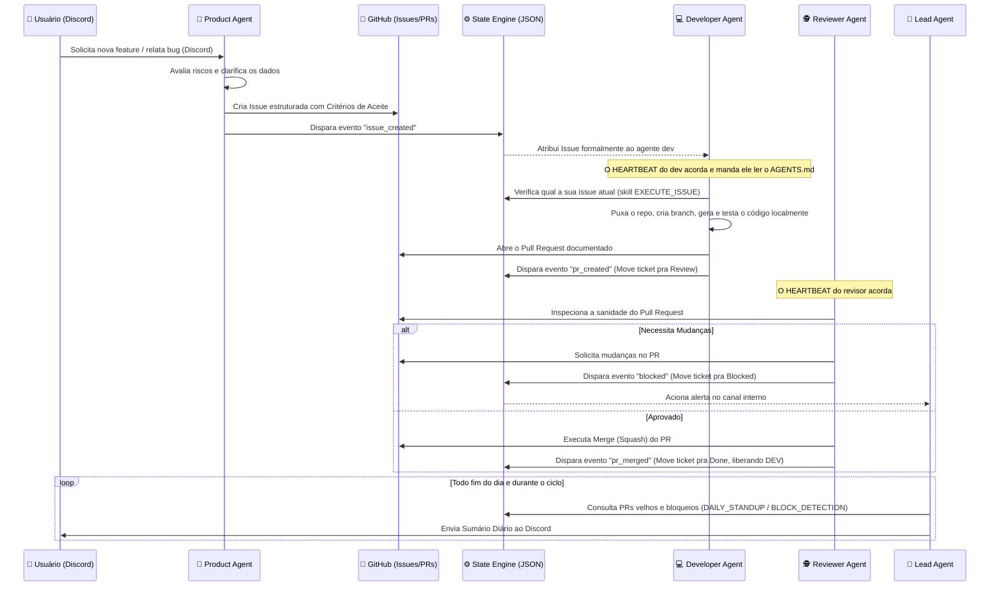

# OpenClaw Multi-Agent Ecosystem

O **OpenClaw Multi-Agent System** é uma arquitetura autônoma de desenvolvimento de software governada por Inteligência Artificial. Ele utiliza múltiplos agentes especializados que cooperam para gerenciar todo o ciclo de vida do desenvolvimento — desde a concepção do produto no Discord até o merge do código no GitHub —, mantendo uma rígida separação de responsabilidades (Triggers, Workflows e Skills) e um motor central de estados (`state-engine`).

## 🧠 Arquitetura de Agentes

O ecossistema é composto por quatro agentes com responsabilidades bem definidas, que assumem a forma de uma squad ágil de alta performance:

- 🎒 **Product Agent:** Interage com os stakeholders vi Discord, ajuda na ideação, analisa riscos corporativos e converte intenções em "GitHub Issues" ricas e estruturadas.
- 💻 **Developer Agent (Alfred):** Absorve as issues designadas a ele, opera no ambiente local (`workspace`), executa o código sob os critérios de aceite e propõe Pull Requests.
- 🕵️ **Reviewer Agent:** Monitora a fila de Pull Requests. Inspeciona o código, avalia a sanidade dos testes e a cobertura dos requisitos. Ele aprova (merge) ou barra (bloqueia) e solicita mudanças.
- 👔 **Lead Agent (Scrum Master):** Atua no cronograma diário montando reportes de Standup diários, avaliando gargalos crônicos (como PRs ou issues paradas) e alertando a equipe de anomalias no fluxo.

## 🔄 Fluxo de Trabalho (Workflow)

Abaixo o diagrama exato de como as entidades se comunicam assincronamente através do `state-engine` e do GitHub, formando o ciclo de vida de uma feature.



## ✨ Principais Funcionalidades

1. **Arquitetura Desacoplada e Segura:**
   - `HEARTBEAT.md`: Atua apenas como "Despertador" temporal. Nenhum comando sensível vive aqui.
   - `AGENTS.md`: Define a lógica processual e comportamental de cada cargo.
   - `SKILLS.md` & `scripts/*.sh`: Segura a "Força Bruta" e as integrações (Scripts, GH CLI, JQ), impedindo alucinações de comandos.
2. **Motor de Estado e Orquestração (`state_engine.sh`):**
   - Transita tarefas no `state.json`, garantindo que os agentes saibam exatamente qual é a pauta real.
   - **Sincronização Automática:** Gerencia labels de status (`inbox`, `in_progress`, etc) e de responsabilidade (`agent:product`, `agent:developer`, `agent:reviewer`) tanto na Issue quanto no PR associado.
3. **Automação de Board e Discord:**
   - **Workflow de Board Robusto:** Integração nativa com GitHub Projects. Issues são criadas diretamente no board via flag `--project` e sincronizadas via GraphQL via `automation.sh`.
   - **Interação Estabilizada:** Otimizações no provisionamento evitam reboots desnecessários, resolvendo o erro `Unknown Interaction` no Discord.
   - **Modo Escuta Ativa:** Agentes de produto operam em modo passivo nos canais, reagindo a demandas sem necessidade de menção `@nome`.
4. **Identidade e Rastreabilidade:**
   - Prevenções para que commits e features não vazem o tracking (ex: Developer assina commits como `alfred-ai-developer`).
   - Ciclo de feedback fechado: Desenvolvedores são alertados e reatribuídos automaticamente quando o review solicita mudanças (`blocked` status).
5. **Estrutura de Threads Elite (`squad` & `lead`):**
   - Transparência total sem ruído: A comunicação técnica ocorre na thread `#squad` (Developer/Reviewer) e a gestão técnica na thread `#lead` (Lead/Standups).
   - Automação via Skill: As threads são criadas automaticamente pela skill `START_PROJECT`, garantindo isolamento total desde o primeiro minuto do projeto.

## 🚀 Como Utilizar e Provisionar

O projeto foi projetado para auto-provisionar as pastas e dependências dos agentes baseado num único script bash que injeta os *fallbacks* (templates padrão de comportamento) de todos os papéis da equipe.

### 1. Requisitos do Servidor / Máquina
Você precisa assegurar a existência instalada e ativa de:
- CLI do GitHub (`gh` autenticado e vinculado a conta e o board).
- Processador de JSON (`jq` via apt/brew).
- Um motor / backend do **OpenClaw** rodando para orquestrar e agendar os heartbeats.
- Uma chave / token para permissões do repo repassados em variável de ambiente.

### 2. Iniciar o Provisionamento (Self-Install Wizard)
Mecanize todo o processo instalando a arquitetura globalmente na sua máquina com um único comando iterativo. 

Esta "Skill de Instalação":
1. Clona/Atualiza a base oficial.
2. Interage no terminal pedindo nome do Projeto, link do Repositório e Canal do Discord.
3. Injeta as Skills em seu diretório e engatilha o `provision.sh` automaticamente.

```bash
curl -sL https://raw.githubusercontent.com/barba-software/openclaw-multiagent-system/main/install.sh | bash
```

*(Alternativamente, para provisionamento manual, você pode dar `git clone` neste repositório, preencher os configs e rodar manualmente `bash workspace/scripts/provision.sh` preenchendo as varáveis).*

### 3. Integração
- Uma vez ligado o webhook / cron cronometrado do `HEARTBEAT.md` no painel do OpenClaw, basta ir ao seu canal do Discord (definido no mapeamento global) e disparar a sua requisição como requerimento em linguagem natural para que o `Product Agent` assuma a liderança.
